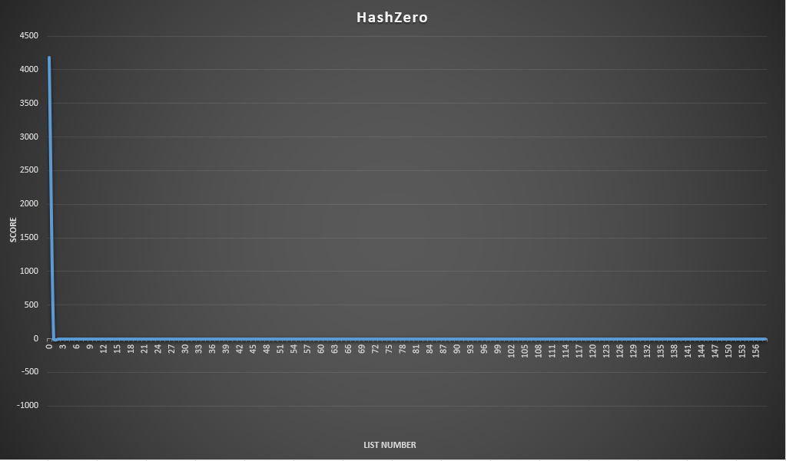

# Fast Hash Table

# Цель проекта
- [ ] Изучить построение хеш-балицы методом цепочек
- [ ] Провести спектральный анализ для различных хеш-функций и сравнить
- [ ] Составить use-case использования и проанализировать узкие места программы
- [ ] Оптимизировать узкие места с помощью SSE, ассемблерных функций и вставок

# 1. Построение хеш-таблицы
Для хранилища памяти была выбрана структура [фрагментированного массива](src/tools/ChunkedArray_.hpp). На нем построен [лист](src/tools/List.hpp) с индексированием через массив, для лучшей оптимизации кеша. [Хэш-таблица](src/tools/HashTable.hpp) утроена, как фрагментированный массив списков. Массив и список сделаны шалонными классами, хэш-таблица для строк длинной до 32 символов. Подробнее в [документации]()

- [x] Изучить построение хеш-балицы методом цепочек

# 2. Анализ хэш-функций
Для анализа был выбран такой набор:
| Хеш-функция    | Результат                            |
|----------------|---------------------                 |
| HashZero       | Просто возвращает 0                  |
| HashOneASCII   | Возвращает код первого сивола        |
| HashLenght     | Возвращает длину строки              |
| HashSumASCII   | Возвращает сумму всех кодов символов |
| HashSumRoll    | Возвращает (TODO)                    |
| HashPolynom    | Возращает полиномиальный хэш         |
| HashCRC32      | Возвращает контрольную сумму crc32   |

---

### HashZero: 

> Scale: 160

---

### HashOneASCII

> Scale: 160

---

### HashLenght

> Scale: 160

---

### HashSumASCII

> Scale: 4096

---

### HashSumRoll

> Scale: 4096

---

### HashPolynom

> Scale: 4096

---

### HashCRC32

> Scale: 4096

---

### Итоги:

    Видим, что простые хеш-функции дают плохое распределение данных. Неплохо распределюят полиномиальный хеш и crc32, но даже в них есть большие пики коллизий. В общем случае не получится подобрать функцию с идеальным распределением, поэтому надо правильно увеличивать кол-во ячеек, чтобы сократить кол-во коллизий.

- [x] Провести спектральный анализ для различных хеш-функций и сравнить

# 3. Находим узкие места, профилировкой программы 

Для тестирования был выбран [датасет](assets/text/big.txt) с сайта https://www.kaggle.com на 1116648 строк. Датасет был разбит на слова и сохранен в HashTable. Будем один раз создавать таблицу и много раз искать в ней совпадения. 

Запустим профайлер (Использован [Intel VTune](https://www.intel.com/content/www/us/en/support/ru-banner-inside.html)).

Видим, что большую часть времени занимает strcmp. Это происходит из-за болшого кол-ва коллизий (большая длина списка). Для начала попробуем ускорить сравнение заменим strcmp на _mm256_cmpeq_epi8.

    bool operator==(const StringAVX& other) const noexcept {        
        __m256i a = _mm256_load_si256((__m256i const*)data_);
        __m256i b = _mm256_load_si256((__m256i const*)other.data_);

        __m256i res = _mm256_cmpeq_epi8(a, b);

        return (_mm256_movemask_epi8(res) + 1) == 0;
    }

Запустим проверку еще раз и видим, что сравнение ускорилось в 2 раза, но все еще является самым долгим из-за больших цепочек.

Посмотрим на размер цепочек:

Видно, что несмотря на хорошее распеределение, средняя длина цепочки достигает 10-13, а на пиках 15-20. Для начала сократим до 10, увеличив количество листов.

Видим, что средняя заполненность листа упала ниже 10. Так же не имеет смысла использовать ChunkedArray для листов маленького размера, напишем SmallList для листов маленького размера. Проверим время.

Видим, что узким местом стала функция хеширования. Напишем более быструю хэш-функцию, используя ассемблерную вставку.

    size_t HashCRC32Asm(const char* val) {
        size_t hash = 0;
        __asm__ (".intel_syntax noprefix\n\t"
            "mov rcx, 4\n\t"
            "0:\n\t"
            "mov rax, [%[arg_val]]\n\t"
            "crc32 %[ret_val], rax\n\t"
            "add %[arg_val], 8\n\t"
            "loop 0b\n\t"
            "1:\n\t"
            ".att_syntax prefix\n\t"
            : [ret_val]"=S"(hash)
            : [arg_val]"D"(val)
            :"%rax", "%rcx", "cc"
        );
        return hash;
    }

Посмторим результат профилированния. 

Видим, что функция хеширования стала работать в 4.5 раза быстрее. 

- [x] Составить use-case использования и проанализировать узкие места программы
- [x] Оптимизировать узкие места с помощью SSE, ассемблерных функций и вставок

# Заключение 

Итого получилась таблица со средней константой на функцию поиска около 5.

Полученное КПД(коэффициент полезности Дединского) для функции поиска: 4.5 / 10 * 1000 = 450.