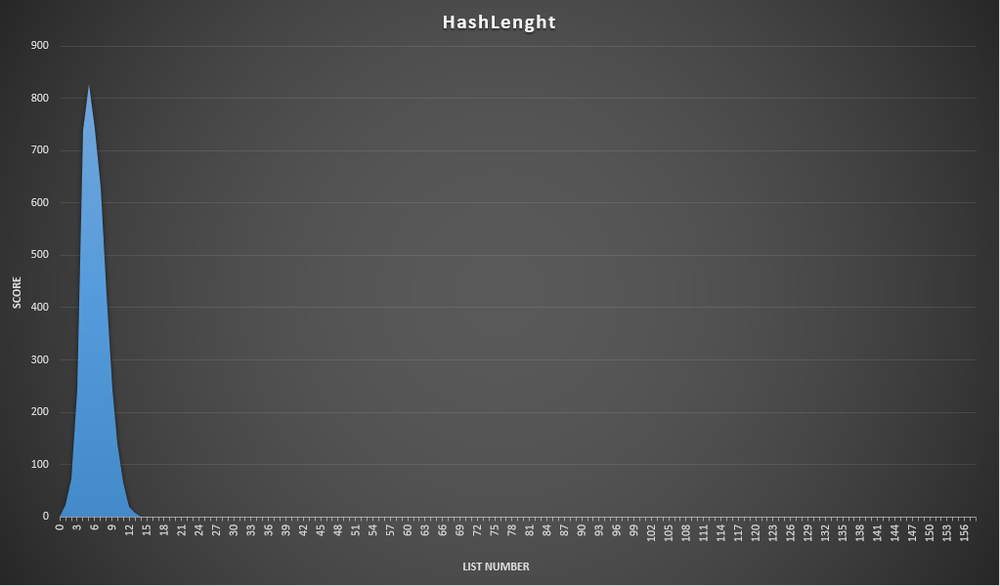

# Fast Hash Table

# Цель проекта
- [ ] Изучить построение хеш-балицы методом цепочек
- [ ] Проанализировать различные хеш-функции на... (TODO)
- [ ] Составить use-case использования и проанализировать узкие места программы
- [ ] Оптимизировать узкие места с помощью SSE, ассемблерных функций и вставок

# 1. Построение хеш-таблицы
Для хранилища памяти была выбрана структура [фрагментированного массива](src/tools/ChunkedArray_.hpp). На нем построен [лист](src/tools/List.hpp) с индексированием через массив, для лучшей оптимизации кеша. [Хэш-таблица](src/tools/HashTable.hpp) утроена, как фрагментированный массив списков. Массив и список сделаны шалонными классами, хэш-таблица для строк длинной до 32 символов. Подробнее в [документации]()

- [x] Изучить построение хеш-балицы методом цепочек

# 2. Анализ хэш-функций
Для анализа был выбран такой набор:
| Хеш-функция    | Результат                            |
|----------------|---------------------                 |
| HashZero       | Просто возвращает 0                  |
| HashOneASCII   | Возвращает код первого сивола        |
| HashSumASCII   | Возвращает сумму всех кодов символов |
| HashLenght     | Возвращает длину строки              |
| HashSumRoll    | Возвращает (TODO)                    |
| HashPolynom    | Возращает полиномиальный хэш         |
| HashCRC32      | Возвращает контрольную сумму crc32   |

---

### HashZero:

---

### HashOneASCII

---

### HashSumASCII

---

### HashLenght

---

### HashSumRoll

---

### HashPolynom

---

### HashCRC32

---